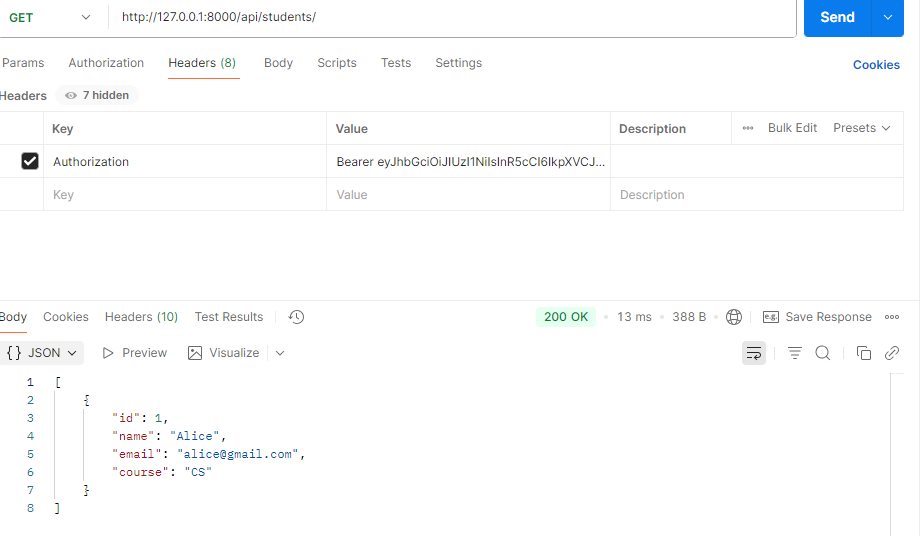
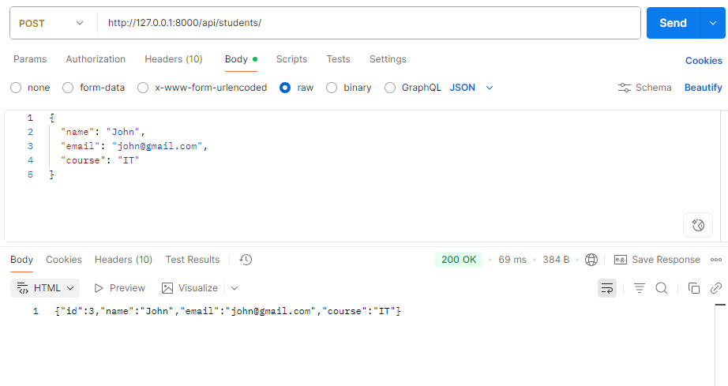
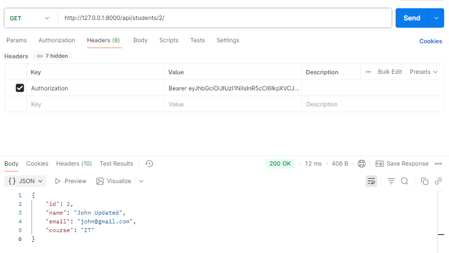
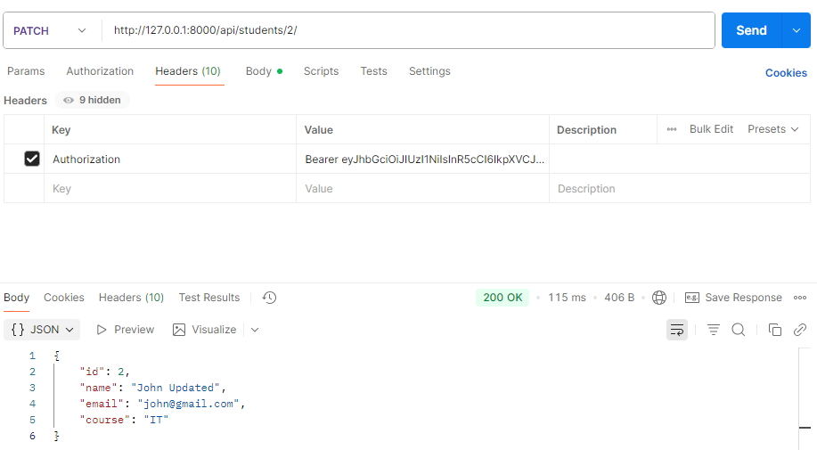
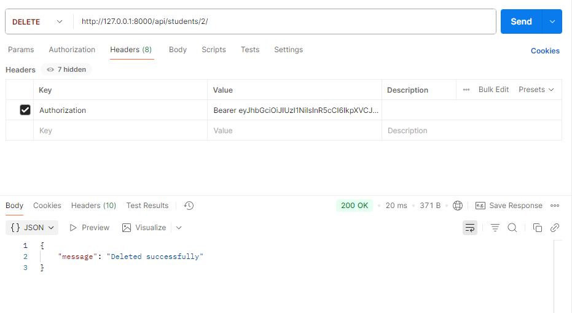

# Student Management REST API

A REST API built using Django REST Framework
for managing students and courses.

## Features
- CRUD operations
- REST API endpoints
- Django REST Framework
- SQLite database

## Tech Stack
- Python
- Django
- Django REST Framework
- SQLite

## Installation

git clone <repo-link>

pip install -r requirements.txt

python manage.py runserver

## API Endpoints

GET /students/
POST /students/
PUT /students/id/
DELETE /students/id/

# Django Blog CRUD App

Features
- Create posts
- Edit posts
- Delete posts
- Admin panel

Tech stack
- Django
- Python
- SQLite

Run instructions
python manage.py runserver