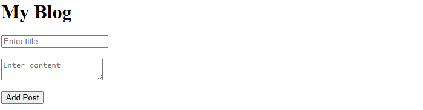
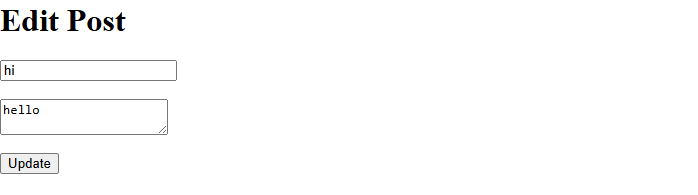
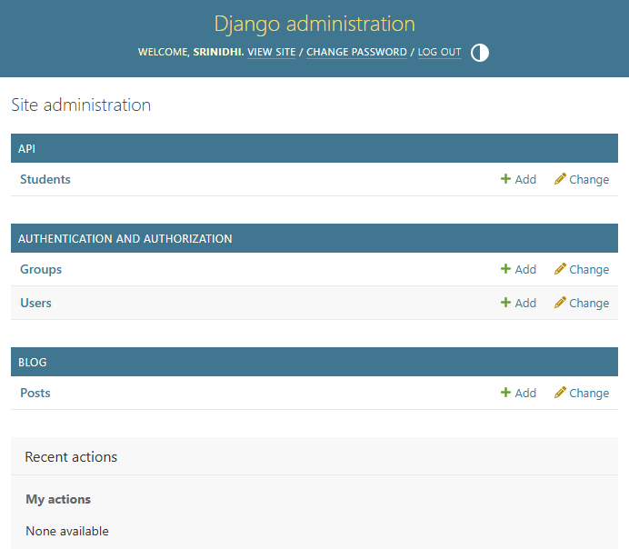

# Django Backend Journey

This repository contains multiple backend projects built while learning Django and Django REST Framework.

## Projects

### 1. Django Blog CRUD App

A web-based CRUD application using Django templates.

#### Features

* Create posts
* View posts
* Edit posts
* Delete posts
* Admin panel integration

#### Tech Used

* Python
* Django
* SQLite
* HTML Templates

---

### 2. Student Management REST API

A REST API built using Django REST Framework for managing students and courses.

#### Features

* CRUD API endpoints
* Serializers
* REST API support
* SQLite database

#### API Endpoints

```text id="48g5fr"
GET /students/
POST /students/
PUT /students/id/
DELETE /students/id/
```

#### Tech Used

* Python
* Django
* Django REST Framework
* SQLite

---

## How to Run

```bash id="efsq5s"
python manage.py runserver
```

Open browser:

```text id="5j7msw"
http://127.0.0.1:8000
```

---

## Future Improvements

* Authentication system
* Better frontend UI
* Pagination
* Search functionality
* JWT Authentication
## Screenshots

### Blog Home Page



### Edit Post Page



### Admin Panel



